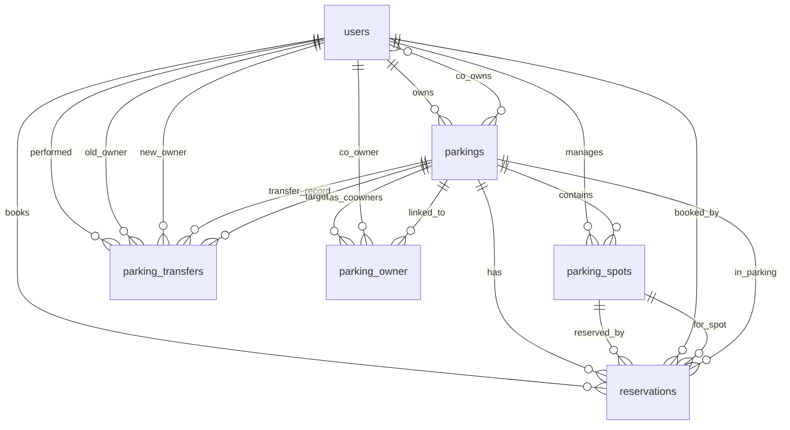
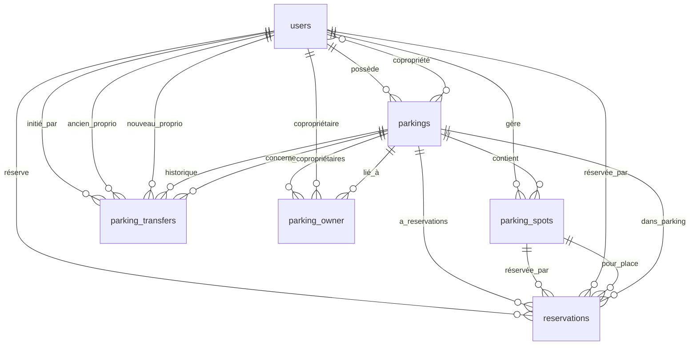

# 🗺️ Entity Relationship Diagram (ERD)

🇬🇧 English Version

## Overview

This ERD provides a visual representation of the main database entities used in SmartParking and how they relate to each other. It is meant to guide developers in understanding the structure and logic behind the system's models and foreign key constraints.

## Mermaid ERD

---

🇫🇷 Version française

## Vue d’ensemble

Ce diagramme ERD présente visuellement les principales entités de la base de données SmartParking et leurs relations. Il aide les développeurs à comprendre la structure des données et les contraintes entre les modèles via les clés étrangères.

## Diagramme Mermaid

