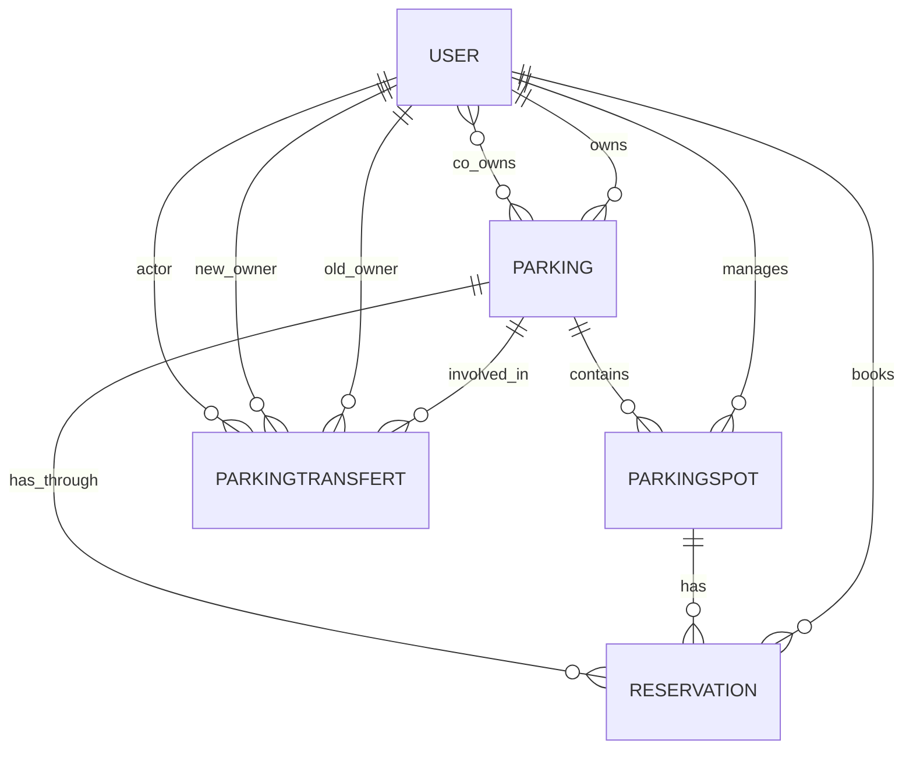

# 📦 Models

🇬🇧 English Version

## Overview

This document describes the main Eloquent models used in the SmartParking application and their relationships.

---

## 🧩 User

### Description
Represents a user of the system. A user can be an administrator, owner, or tenant.  
Users can own parkings and parking spots, and make reservations.

### Fillable attributes
- `first_name`
- `last_name`
- `email`
- `password`
- `is_admin`
- `is_owner`
- `is_tenant`

### Relationships
- `parkings()`: HasMany → Parkings the user owns.
- `parkingSpots()`: HasMany → Spots managed by the user.
- `reservations()`: HasMany → Reservations made by the user.
- `coOwnedParkings()`: BelongsToMany → Parkings where the user is a co-owner.
- `createdParkings()`: HasMany → Parkings created by the user.

---

## 🧩 Parking

### Description
Represents a group of parking spots belonging to a main owner (user).  
A parking can also have multiple co-owners.

### Fillable attributes
- `name`, `street`, `location_number`, `zip_code`, `city`, `country`
- `total_capacity`, `is_open_24h`, `opening_hours`, `opening_days`
- `user_id`, `is_active`

### Relationships
- `user()`: BelongsTo → Main owner.
- `spots()`: HasMany → Parking spots in the parking.
- `reservations()`: HasManyThrough → Reservations via spots.
- `coOwners()`: BelongsToMany → Users who co-own this parking.

---

## 🧩 ParkingSpot

### Description
Represents a single physical parking spot, assignable to a user and belonging to a parking.

### Fillable attributes
- `identifier`
- `parking_id`
- `user_id`
- `allow_electric_charge`
- `is_available`
- `per_day_only`
- `price_per_day`
- `price_per_hour`
- `note`

### Relationships
- `parking()`: BelongsTo → The parking structure.
- `user()`: BelongsTo → Owner of the spot.
- `reservations()`: HasMany → Reservations for this spot.

---

## 🧩 Reservation

### Description
Represents a reservation made by a user on a parking spot.

### Fillable attributes
- `user_id`, `parking_spot_id`, `parking_id`
- `start_datetime`, `end_datetime`
- `license_plate`, `status`, `group_token`

### Relationships
- `user()`: BelongsTo → User who made the reservation.
- `parkingSpot()`: BelongsTo → Reserved spot.
- `parking()`: (via `parkingSpot`) → Parent parking.

---

## 🧩 ParkingTransfert

### Description
Keeps track of ownership changes of a parking from one user to another.

### Fillable attributes
- `parking_id`, `old_user_id`, `new_user_id`, `performed_by`

### Relationships
- `parking()`: BelongsTo → Affected parking.
- `oldUser()`: BelongsTo → Former owner.
- `newUser()`: BelongsTo → New owner.
- `actor()`: BelongsTo → Initiator of the transfer (admin or manager).

---

## 📊 Relationship Diagram (ERD)

---

🇫🇷 Version française

## Vue d’ensemble

Ce document décrit les principaux modèles Eloquent utilisés dans l’application SmartParking et leurs relations.

---

## 🧩 User (Utilisateur)

### Description
Représente un utilisateur du système. Il peut être administrateur, propriétaire ou locataire.  
Les utilisateurs peuvent posséder des parkings, des places, et effectuer des réservations.

### Attributs `fillable`
- `first_name`
- `last_name`
- `email`
- `password`
- `is_admin`
- `is_owner`
- `is_tenant`

### Relations
- `parkings()`: HasMany → Parkings possédés par l’utilisateur.
- `parkingSpots()`: HasMany → Places gérées par l’utilisateur.
- `reservations()`: HasMany → Réservations effectuées par l’utilisateur.
- `coOwnedParkings()`: BelongsToMany → Parkings où l’utilisateur est copropriétaire.
- `createdParkings()`: HasMany → Parkings créés par l’utilisateur.

---

## 🧩 Parking

### Description
Représente un ensemble de places appartenant à un utilisateur principal.  
Un parking peut aussi avoir plusieurs copropriétaires.

### Attributs `fillable`
- `name`, `street`, `location_number`, `zip_code`, `city`, `country`
- `total_capacity`, `is_open_24h`, `opening_hours`, `opening_days`
- `user_id`, `is_active`

### Relations
- `user()`: BelongsTo → Propriétaire principal.
- `spots()`: HasMany → Places de parking contenues dans ce parking.
- `reservations()`: HasManyThrough → Réservations via les places.
- `coOwners()`: BelongsToMany → Copropriétaires du parking.

---

## 🧩 ParkingSpot (Place de parking)

### Description
Représente une place physique assignée à un utilisateur, appartenant à un parking.

### Attributs `fillable`
- `identifier`
- `parking_id`
- `user_id`
- `allow_electric_charge`
- `is_available`
- `per_day_only`
- `price_per_day`
- `price_per_hour`
- `note`

### Relations
- `parking()`: BelongsTo → Parking parent.
- `user()`: BelongsTo → Propriétaire de la place.
- `reservations()`: HasMany → Réservations de cette place.

---

## 🧩 Reservation (Réservation)

### Description
Représente une réservation d’une place de parking effectuée par un utilisateur.

### Attributs `fillable`
- `user_id`, `parking_spot_id`, `parking_id`
- `start_datetime`, `end_datetime`
- `license_plate`, `status`, `group_token`

### Relations
- `user()`: BelongsTo → Utilisateur ayant effectué la réservation.
- `parkingSpot()`: BelongsTo → Place réservée.
- `parking()`: (via `parkingSpot`) → Parking parent.

---

## 🧩 ParkingTransfert (Transfert de propriété)

### Description
Historique du changement de propriétaire d’un parking.

### Attributs `fillable`
- `parking_id`, `old_user_id`, `new_user_id`, `performed_by`

### Relations
- `parking()`: BelongsTo → Parking concerné.
- `oldUser()`: BelongsTo → Ancien propriétaire.
- `newUser()`: BelongsTo → Nouveau propriétaire.
- `actor()`: BelongsTo → Utilisateur à l’origine du transfert.

---

## 📊 Diagramme de relations (ERD)

